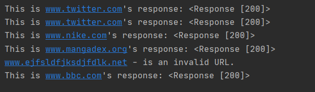

## Short Scripts creation

- Using modules, I will be creating scripts for random small tasks.

### Modules:
- **Requests:**
1. Created a status code web crawler. 
```python
# Import the requests module
import requests

# Creating a variable called url
url = "www.twitter.com"
url2 = ["www.twitter.com", "www.nike.com", "www.mangadex.org", "www.ejfsldfjksdjfdlk.net", "www.bbc.com"]

# This try block is running the script the script as follows...
try:
    # var created. A get request is concatenating https in front of the URL variable.
    get_response = requests.get("https://" + url)
    # Variable response printed.
    print(f"This is {url}'s response:", get_response)

# Similar to else, it checks to see if the requests module has found and exception of connection error type.
# This is a test to see whether the try was successful.
except requests.exceptions.ConnectionError:
    print("no such website...")

# Trying to get responses from a list of sites
for i in url2:
    try:
        respond = requests.get("https://" + i)
        print(f"This is {i}'s response:", respond)

    except requests.exceptions.ConnectionError:
        print(i, "- is an invalid URL.")
```
- **Code output**


2. Subdomain finder
- Using a list word list, I crawled ```twitter``` for subdomains that would respond if it existed.

```python
#------------"""SUBDOMAIN Finder"""---------------#

target_url1 = "twitter.com"

# Opening wordlist location using "with open()", specifying reading mode ('r') and storing value of search as 'file'
with open("C:\\Users\\--D---\\PycharmProjects\\modules_scripts\\wordlist\\sub_word_list.txt", 'r') as file:
    # iterating over each line within file
    for line in file:
        # stripping all white spaces that may be included in the line
        word = line.strip()
        # concatenating result of word var, full stop and target url 1 variable
        test_url = word + "." + target_url1
        # storing request
        response = request(test_url)

        if response:
            print(f"Subdomain: {test_url}, exists.")
        else:
            print(f"{test_url} >> no response.")
```